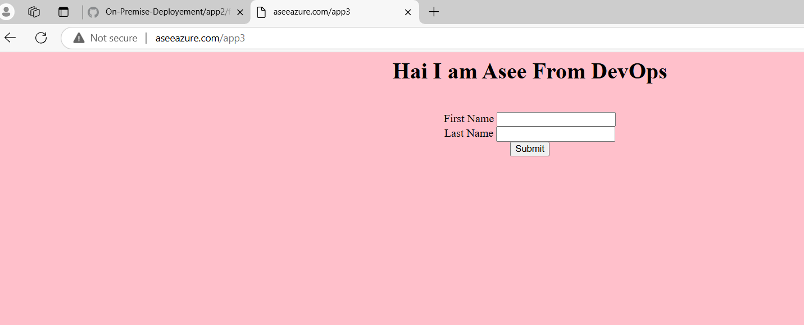
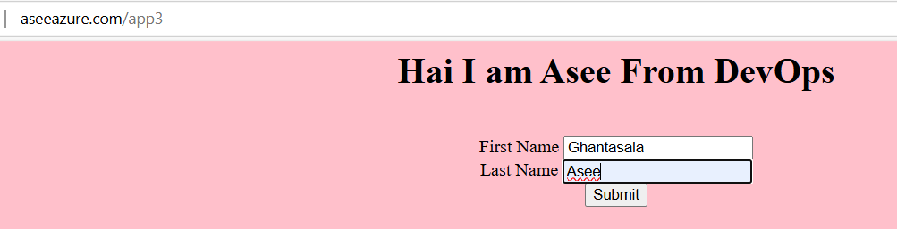
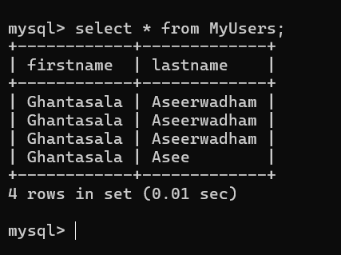

### On-premises deployment:
---------------------------

* Launch 2 VMS, and do require configurations
```bash
ssh root@<ip-address> -22
sed -i 's/mirrorlist/#mirrorlist/g' /etc/yum.repos.d/CentOS-Linux-*
sed -i 's|#baseurl=http://mirror.centos.org|baseurl=http://vault.centos.org|g' /etc/yum.repos.d/CentOS-Linux-*

vim /etc/yum.repos.d/local.repo& add the below lines
 
[InstallMedia-BaseOS]
name=CentOS Linux 8 - BaseOS
metadata_expire=-1
gpgcheck=1
enabled=1
baseurl=file:////run/media/root/CentOS-8-5-2111-x86_64-dvd/BaseOS/
gpgkey=file:///etc/pki/rpm-gpg/RPM-GPG-KEY-centosofficial
 
[InstallMedia-AppStream]
name=CentOS Linux 8 - AppStream
metadata_expire=-1
gpgcheck=1
enabled=1
baseurl=file:////run/media/root/CentOS-8-5-2111-x86_64-dvd/AppStream/
gpgkey=file:///etc/pki/rpm-gpg/RPM-GPG-KEY-centosofficial
 
vim /etc/yum.repos.d/mysql.repo& add the following lines
 
[mysql57-community]
name=MySQL 5.7 Community Server
baseurl=http://repo.mysql.com/yum/mysql-5.7-community/el/6/$basearch/
enabled=1
gpgcheck=1
gpgkey=file:///etc/pki/rpm-gpg/RPM-GPG-KEY-mysql-2022
```

##
```bash
yum install mariadb-devel gcc* redhat-rpm-config python3-devel

vim /etc/hostname
hostnamectl --set-hostname Linux_VM_01

mkdir app1
vim main.py
Paste

to expose outside created---->wsgi(web server gateway interface)
vim wsgi.py


to run we need to install package ---> flask
pip3(package manager)
pip3 install flask
pip3 install gunicorn
pythom main.py

yum -y install python


netstat -ntpl (Active intenet connections---->only servers)

netstat -ntpl (which ports are opened)
systemctl status firewalld
firewall-cmd --zone=public --add-port=5001/tcp --permanent   (add port numbers on local servers)
firewall-cmd --reload


```sh

      - yum install mariadb-devel gcc* redhat-rpm-config python3-devel
      - mkdir /app1
      - cd /app1
      - vim main.py

```bash
from flask import Flask
app = Flask(__name__)

@app.route("/app1")
def hello():
    return "Hello from App1"

- vim wsgi.py

from main import app as application
app=application

if __name__ == '__main__':
    app.run(host='0.0.0.0',port=5001) 

- pip3 install flask
- pip3 install gunicorn
- firewall-cmd --zone=public --add-port=5001/tcp --permanent
- firewall-cmd --reload
- gunicorn --bind=0.0.0.0:5001 wsgi  (**here app is running in frontend**)


***so to make to run our app in backend used service in /etc/systemd/system***

- cd /etc/systemd/system/

- vim app1.service

[Unit]
Description=gunicorn daemon
After=network.target

[Service]
User=root
Group=root
WorkingDirectory=/app1
ExecStart=gunicorn --access-logfile='app1.log'  --bind=0.0.0.0:5001  wsgi

[Install]
WantedBy=multi-user.target

```sh
systemctl stop app1
systemctl daemon-reload
systemctl start app1
```

## web server or load balancer nginx:
```sh
yum install -y nginx
firewall-cmd --zone=public --add-port=5001/tcp --permanent
firewall-cmd --reload
systemctl daemon-reload
systemctl restart nginx
```

* Configuration required for load balance
```
/etc/nginx/nginx.conf
    server {
listen 80;
server_name 192.168.1.3 ;
location /app2 {

        proxy_set_header Host $http_host;
        proxy_set_header X-Real-IP $remote_addr;
        proxy_set_header X-Forwarded-For $proxy_add_x_forwarded_for;
        proxy_set_header X-Forwarded-Proto $scheme;

        #proxy_pass http://unix:/app/app.sock;
        proxy_pass http://192.168.1.3:5000;   }
location /app1 {

        proxy_set_header Host $http_host;
        proxy_set_header X-Real-IP $remote_addr;
        proxy_set_header X-Forwarded-For $proxy_add_x_forwarded_for;
        proxy_set_header X-Forwarded-Proto $scheme;

        #proxy_pass http://unix:/app/app.sock;
        proxy_pass http://192.168.1.51:5000;   }
}
```

# Add dns 
c/users/windows/system32/etc/hosts
add <nginx ip> <dns--aseeazure.com>

## (set up DB and its manual configuration)

```yum -y install mysql-server -y```

* mysql-server helps to convert the mysql server to database server.

# To start database:
-------------------
```sh
service mysqld start (d for daemon which means server in linux)
service mysqld status
mysql_secure_installation  (set password here and remember)
```


## To connect to database

```sh
 mysql -u root -p
```

# in db
```sh
create user 'app1'@'192.168.17.128' identified by 'P@$$w0rd';
grant all privileges on appdata.* to 'app1'@'192.168.17.128'
flush privileges (it just reloads)
```
openfire for mysql
```
netstat -ntpl
firewall-cmd --zone=public --add-port=3306/tcp --permanent   (add port numbers on local servers)
firewall-cmd --reload
```
getenforce
setenforce 0
netstat -o -a (to get process ids using the ip/port)

# in app
* give this info/configuration in application server(like ip, user, password, database)
* also create a folder templates-->html
<HTML>
<BODY bgcolor="pink">
<form method="POST" action="">
    <center>
    <H1>Enter your details </H1> <br>
    First Name <input type = "text" name= "fname" /> <br>
    Last Name <input type = "text" name = "lname" /> <br>
    <input type = "submit">
    </center>
</form>
</BODY>
</HTML>

```pip3 install flask_mysqldb (To integrate app to db need to install)```


```sh
vim main.py

from flask import Flask, render_template, request
from flask_mysqldb import MySQL
app = Flask(__name__, template_folder='/app3/templates/')


app.config['MYSQL_HOST'] = '192.168.220.130'
app.config['MYSQL_USER'] = 'app3'
app.config['MYSQL_PASSWORD'] = 'Asee@12345'
app.config['MYSQL_DB'] = 'appdata'

mysql = MySQL(app)


@app.route('/app3', methods=['GET', 'POST'])
def index():
    if request.method == "POST":
        details = request.form
        firstName = details['fname']
        lastName = details['lname']
        cur = mysql.connection.cursor()
        cur.execute("INSERT INTO MyUsers (FirstName, LastName) VALUES (%s, %s)", (firstName, lastName))
        mysql.connection.commit()
        cur.close()
        return 'success'
    return render_template('index.html')
	





