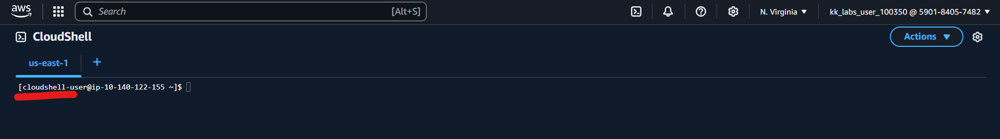
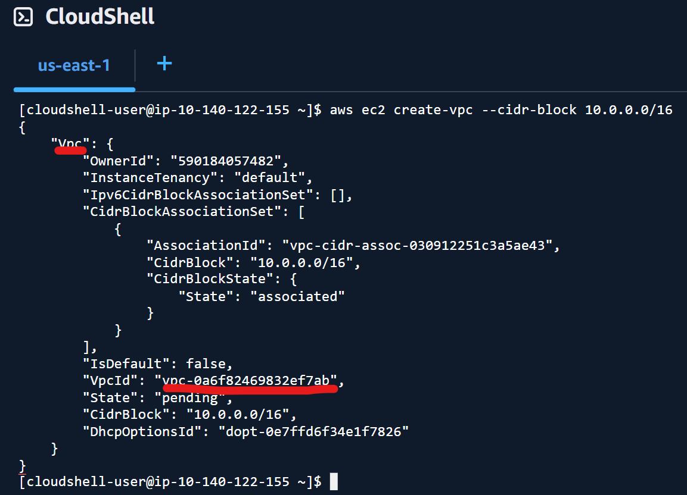
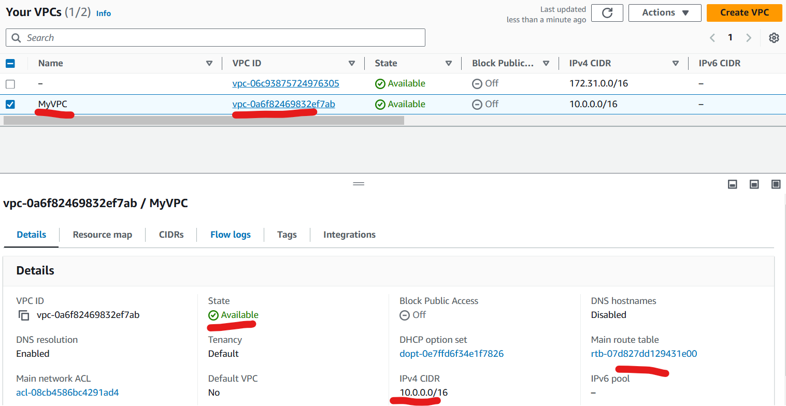
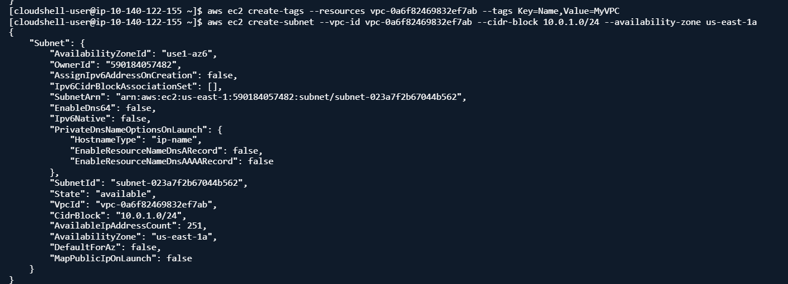
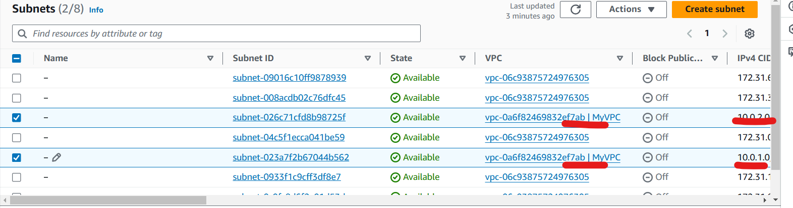
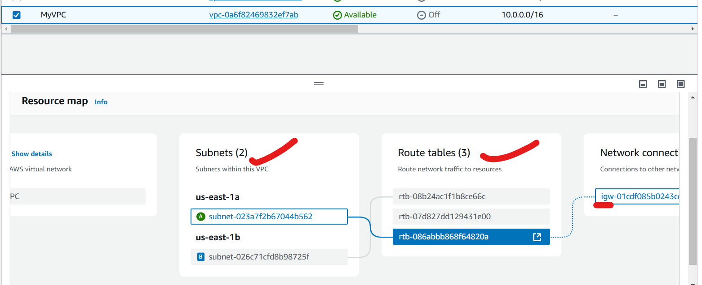
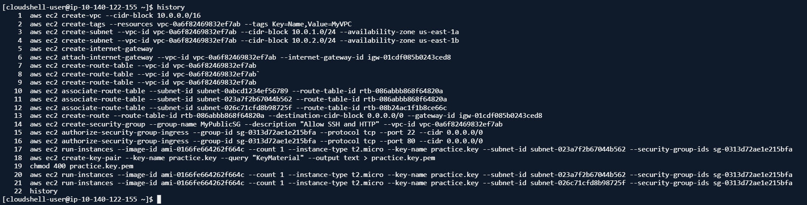
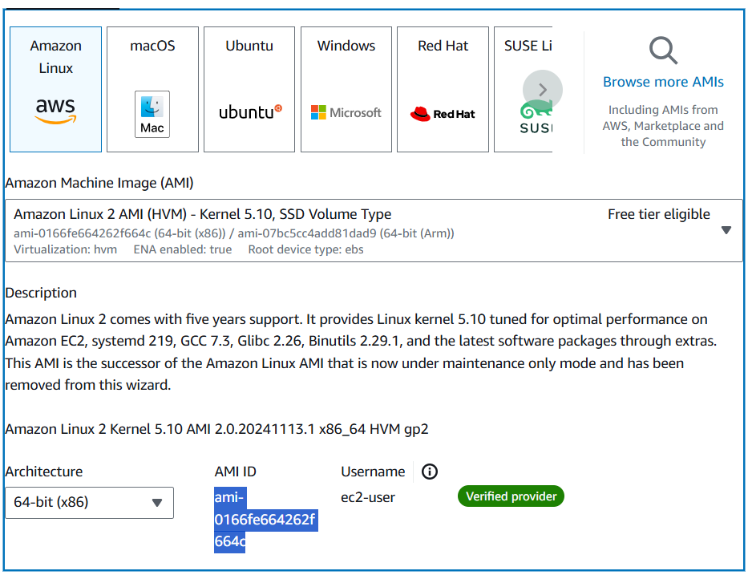
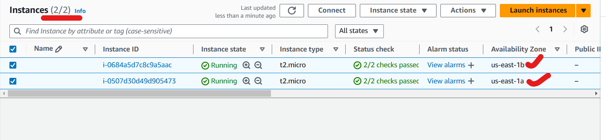

## CLI - Task


* Install and Setup AWS cli on Local machine
* Config PA credentials 
    * aws configure
    * Access key, Secret Key, region, output format

# Create VPC using cli:

   ```aws ec2 create-vpc --cidr-block 10.0.0.0/16```
   ```aws ec2 create-tags --resources vpc-0a6f82469832ef7ab --tags Key=Name,Value=MyVPC```








# create Pub and Pvt subnets
   * pub:
   ```aws ec2 create-subnet --vpc-id vpc-0a6f82469832ef7ab --cidr-block 10.0.1.0/24 --availability-zone us-east-1a```
   * pri:
   ```aws ec2 create-subnet --vpc-id vpc-0a6f82469832ef7ab --cidr-block 10.0.2.0/24 --availability-zone us-east-1b```





# create IGW:
   ```aws ec2 create-internet-gateway```

# Attach IGW to VPC:
   ```aws ec2 attach-internet-gateway --vpc-id vpc-0a6f82469832ef7ab --internet-gateway-id igw-01cdf085b0243ced8```

# Create Pub and PVT RT:
   * pub:
   ```aws ec2 create-route-table --vpc-id vpc-0a6f82469832ef7ab```
   * pri:
   ```aws ec2 create-route-table --vpc-id vpc-0a6f82469832ef7ab```

# Attach Pub sub to Pub rt:
   ```aws ec2 associate-route-table --subnet-id subnet-023a7f2b67044b562 --route-table-id rtb-086abbb868f64820a```

# Attach Pvt Sub to Pvt rt:
   ```aws ec2 associate-route-table --subnet-id subnet-026c71cfd8b98725f --route-table-id rtb-08b24ac1f1b8ce66c```

# Attach IGW to Pub RT:
   ```aws ec2 create-route --route-table-id rtb-086abbb868f64820a --destination-cidr-block 0.0.0.0/0 --gateway-id igw-01cdf085b0243ced8```


# Create Sg for ssh // http:
```aws ec2 create-security-group --group-name MyPublicSG --description "Allow SSH and HTTP" --vpc-id vpc-0a6f82469832ef7ab```
```aws ec2 authorize-security-group-ingress --group-id sg-0313d72ae1e215bfa --protocol tcp --port 22 --cidr 0.0.0.0/0```
```aws ec2 authorize-security-group-ingress --group-id sg-0313d72ae1e215bfa --protocol tcp --port 80 --cidr 0.0.0.0/0```

# Create a Ec2 in Pub Sub:
```
aws ec2 create-key-pair --key-name practice.key --query "KeyMaterial" --output text > practice.key.pem
chmod 400 practice.key.pem
```

```aws ec2 run-instances --image-id ami-0166fe664262f664c --count 1 --instance-type t2.micro --key-name practice.key --subnet-id subnet-023a7f2b67044b562 --security-group-ids sg-0313d72ae1e215bfa```

# Create a Ec2 in Pvt Sub:
```aws ec2 run-instances --image-id ami-0166fe664262f664c --count 1 --instance-type t2.micro --key-name practice.key --subnet-id subnet-026c71cfd8b98725f --security-group-ids sg-0313d72ae1e215bfa```







