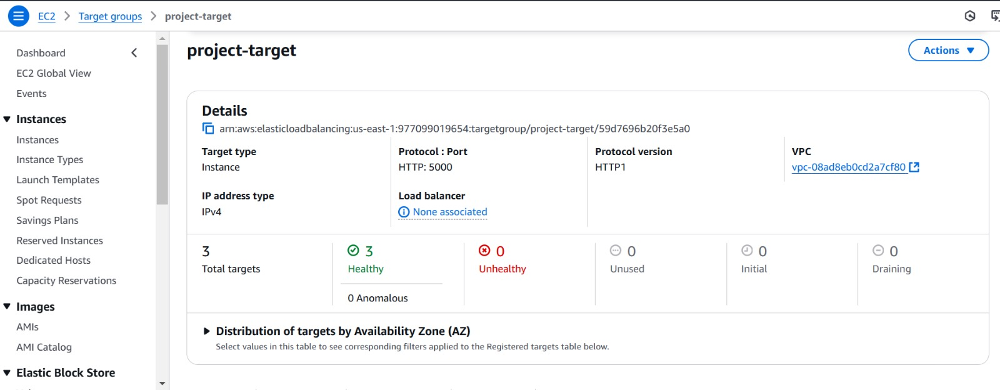

## Requirement 

- Create VPC with /16 range

- Create IGW for VPC
- Create Two Subnets
- Pub and Pvt
- Pub Should have 4k Ip's
- Pvt Should Have 256 Ip's

- Create 3 servers across diff subnets.

- These servers are used for running application
- Create a DB - using RDS

- CODE For the Project - https://github.com/Ai-TechNov/On-Premise-Deployement.git

- Create 3 ec2 instance across Pvt-Subnets
- Deploy Above mentioned python code on the ec2's
- Create and Integrate RDS - DB within the code across all the 3 ec2. 
- As the app is running on PVT, it should be accessible via www !!
- The DB should be purely Pvt, and access should remian strictly to the admin !!

- For the Above infra, i want load-balancing to be configured.
- I want  Auto scaling for the 3 ec2's in order to avoid FT.
- These instances should be monitored and notificaitons should be in place !!

- Finally, The routing should happen via, ROUTE-53 using a Custom domain !

- IF any users browses the CDN, it should reach to app, where the app should collect user info and store it to the DB.
But, i want all the infra to be deployed in pvt-resources !!

